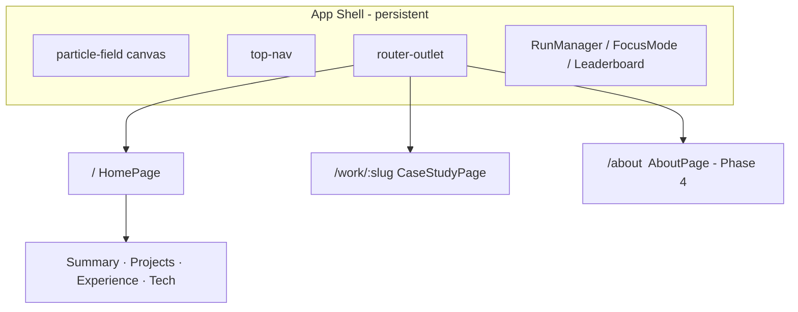

# Ship Room — Portfolio Upgrade Plan

Master implementation plan for the ResumeSite portfolio overhaul. Inspired by [Figma’s portfolio examples](https://www.figma.com/resource-library/portfolio-website-examples/) and tailored to this stack: **Angular**, **canvas game**, **WebGL hero**, **Firebase**, **GitHub Pages** (`Jason.io`).

**Source repo (dev):** [Coding-Project-Files / ResumeSite](https://github.com/Upserge/Coding-Project-Files/tree/master/source/repos/cs-projects/ResumeSite)  
**Production Host:** [upserge.github.io/Jason.io](https://upserge.github.io/Jason.io/)

---

## Status snapshot

Last updated: **2026-06-13**

| Phase | Focus | Status |
|-------|--------|--------|
| **Phase 1** | Case study foundation | **Mostly complete** — see [Phase 1 notes](#phase-1--case-study-foundation) |
| **Phase 2** | Game ↔ story connection | Not started |
| **Phase 3** | Cinematic work reel | Not started |
| **Phase 4** | About + proof | Not started |

**Related work (outside Ship Room phases, already shipped):**

| Track | Status |
|-------|--------|
| Hero WebGL + entrance timing (Aesthetic Priority 1) | Done |
| Tech chips + featured projects grid (Priority 3) | Done |
| Performance pass (spatial connections, lite black holes, tab pause) | Done |
| `deploy.ps1` / `npm run deploy` pipeline | Done |

**Open follow-ups from Phase 1:**

- [ ] Replace VALORANT Premier placeholder hero (`public/case-studies/valorant-premier-hero.svg`) with licensed press art
- [ ] Add real colleague testimonial in `riot-valorant.ts`
- [ ] Particle field: full-page coverage on route changes (partial fix in `particle-field.ts`; revisit end of iteration)
- [ ] Optional: pause or scope game systems on case study routes

---

## Keeping this doc in sync across machines

This file lives in the **ResumeSite source tree**, not in the Jason.io production repo.

When you run **`npm run deploy`** (or `.\deploy.ps1`):

1. **All changes under** `source/repos/cs-projects/ResumeSite/` — including `docs/` — are committed to **`Coding-Project-Files` on `master`** and pushed to GitHub.
2. Only the **built static assets** go to the **Jason.io** repo (production site).

On another computer:

```bash
git clone https://github.com/Upserge/Coding-Project-Files.git
cd Coding-Project-Files/source/repos/cs-projects/ResumeSite
npm install
# Read the plan:
# docs/SHIP-ROOM-PLAN.md
```

Update this doc when you finish a phase or change scope. Commit via normal git workflow or let `deploy.ps1` pick it up on the next deploy.

---

## North star

**Goal:** A recruiter understands in 60 seconds that you ship quality at scale — and in 5 minutes can read proof, not just bullet points.

**Success criteria (when done):**

| Signal | Target |
|--------|--------|
| On-site case studies | ≥ 2 (Resume Site + Riot/VALORANT) |
| Game purpose | Explained in UI within 10s of first interaction |
| Projects section | Cinematic reel + path to case studies |
| Credibility | About section with photo, stats, ≥ 1 testimonial |
| Production | Still deploys via `deploy.ps1` to Jason.io |
| Tests | Existing 85+ specs still pass; add route/content tests |

---

## Architecture (Phase 1 target — implemented)



### Key paths (implemented)

| Area | Location |
|------|----------|
| App shell | `src/app/app.ts`, `app.html`, `app.css` |
| Home page | `src/app/pages/home-page/` |
| Case study page | `src/app/pages/case-study-page/` |
| Case study content | `src/app/content/case-studies/` |
| Routes | `src/app/app.routes.ts` |
| Deploy script | `deploy.ps1` |

**Routes today:**

| URL | Page |
|-----|------|
| `/` | Home |
| `/work/resume-site` | Resume Site case study |
| `/work/riot-valorant` | VALORANT Premier & Competitive case study |
| `/about` | Phase 4 (not built yet) |

---

## Phase 1 — Case study foundation

**Priority #1 · Highest employer impact**

### 1.1 Routing shell

| Task | Status |
|------|--------|
| Extract `HomePage` from monolithic `App` | Done |
| Shell: nav + `<router-outlet>` | Done |
| Lazy routes for home + case studies | Done |
| `withInMemoryScrolling` in `app.config.ts` | Done |
| `scrollTo()` navigates home before section scroll | Done |
| Shader hero init/destroy on home enter/leave | Done |
| Particle layout refresh on home mount | Partial |

### 1.2 Case study content model

| File | Purpose |
|------|---------|
| `src/app/content/case-study.types.ts` | Shared interfaces |
| `src/app/content/case-studies/index.ts` | Registry + `getCaseStudy(slug)` |
| `src/app/content/case-studies/resume-site.ts` | Meta case study |
| `src/app/content/case-studies/riot-valorant.ts` | Flagship credibility study |
| `src/app/content/case-studies/index.spec.ts` | Registry tests |

### 1.3 Case study page UI

Layout: hero → overview → metrics → sections → links. See `case-study-page.html`.

Placeholder assets: `public/case-studies/*.svg`

### 1.4 Projects → case studies

- `ProjectItem.caseStudySlug` on Resume Site → `resume-site`
- Project cards: **Read case study** + **View project**
- Summary callout + Riot experience entries → `/work/riot-valorant`

### 1.5 Content

**`resume-site`** — drafted in `resume-site.ts`

**`riot-valorant`** — drafted with your Premier/Competitive facts; testimonial and hero image still placeholder.

**Phase 1 exit:** Deploy with 2 live case study URLs. *(Ready to deploy when you ask.)*

---

## Phase 2 — Game ↔ story connection

**Priority #2 · Makes the game intentional**

### 2.1 “Why the game?” onboarding strip

One-line thesis on home (below hero or in summary). Collapsible “What am I playing?” with 3 bullets tying game to résumé.

**Files:** `home-page.html`, `home-page.css`, optional `src/app/content/game-narrative.ts`

### 2.2 Score-tier narrative toasts

| Score | One-time toast |
|-------|----------------|
| 5 | Focus mode / spectacle vs clarity |
| 15 | Entropy + combos as systems thinking |
| 50 | Builder mode + link to Resume Site case study |

Each fires once per session (`sessionStorage`).

### 2.3 Upgrade → résumé bridge

Flavor copy on certain upgrades (e.g. black hole → scale/quality at Riot). Copy in `game-narrative.ts`, not hardcoded in game logic.

### 2.4 Command palette

**Ctrl+K** / `/` — jump to section, open case study, copy email, toggle theme, “Explain the game”. Extend `keyboard-shortcuts.ts` / hints modal.

### 2.5 Focus mode copy upgrade

Explain opacity tiers (0 / 5 / 10 / 15 score). Optional “Reading mode” label.

**Phase 2 exit:** First-time visitors understand the game without an interview explanation.

---

## Phase 3 — Cinematic work reel

**Priority #3 · First impression after hero**

### 3.1 Horizontal work reel

**New:** `src/app/components/work-reel/` — scroll-snap panels above or replacing projects grid.

Per panel: hero visual, title, hook, tags, case study + live demo CTAs.

Extend `ProjectItem` with `heroImage?: string`.

### 3.2 Visual assets

**New folder:** `public/work/` — WebP screenshots per project.

### 3.3 Grid fallback

Compact grid below reel, or reel-only on desktop / grid on mobile.

**Phase 3 exit:** Projects section feels portfolio-grade.

---

## Phase 4 — About + proof

**Priority #4 · Trust and humanity**

### 4.1 About route `/about`

**New:** `src/app/pages/about-page/`, `src/app/content/about.ts`

Sections: photo + bio, stats HUD, testimonials, downloads, links. Add **About** to nav.

### 4.2 Home teaser

Testimonial pull-quote in summary; stats row under lead.

### 4.3 Optional PDF export (4b)

Print CSS or static PDF — lower priority.

**Content needed:**

- Headshot → `public/jason-about.webp`
- 1+ testimonial (quote + attribution)
- Short bio in your voice

**Phase 4 exit:** Site answers “who is Jason?” not only “what has Jason listed?”

---

## Cross-cutting concerns

### Testing

| Phase | Tests to add |
|-------|----------------|
| 1 | Registry spec (done); optional `case-study-page` component spec |
| 2 | `game-narrative.spec.ts` — tiers, once-per-session |
| 3 | `work-reel.spec.ts` — panel count |
| 4 | `about-page.spec.ts` — stats render |

Run **`npm test`** before every deploy.

### Accessibility

- Case studies: single `h1`, heading hierarchy
- Reel: keyboard focus, `aria-label` on scroll region
- Command palette: focus trap, Escape closes
- Game toasts: `aria-live="polite"`, non-blocking

### Performance

- Lazy-load routed pages (done for home + case studies)
- WebP + `loading="lazy"` on reel assets
- Particle game pauses when tab hidden (done)
- No extra WebGL on case study pages

### SEO

Per-route `Title` via Angular `Title` service (case studies set title today).

---

## Deploy checkpoints

| After | Command | Verify |
|-------|---------|--------|
| Phase 1 | `npm run deploy` | `/Jason.io/work/resume-site` and `/work/riot-valorant` load |
| Phase 2 | `npm run deploy` | Score toasts, palette works |
| Phase 3 | `npm run deploy` | Reel scroll + mobile |
| Phase 4 | `npm run deploy` | `/Jason.io/about` live |

**Note:** `deploy.ps1` commits **source** (including this doc) to Coding-Project-Files, then pushes **dist** to Jason.io. Do not deploy unless you intend to update production.

---

## Scope control (deferred — Phase 5+)

- Full Three.js navigation (Bruno Simon style)
- AI “Ask about Jason” chat
- Comments on projects
- Theme variants (Riot mode / SpaceX mode)
- Remotion video loops

---

## Related planning artifacts (Cursor-only, not in git)

These live under your Cursor workspace metadata and are **not** pushed to GitHub unless copied into `docs/`:

| Artifact | Purpose |
|----------|---------|
| `resume-site-tech-stack.canvas.tsx` | Stack map + aesthetic priorities |
| `hero-priority-1-mockup.canvas.tsx` | Hero before/after |
| `hero-priority-3-mockup.canvas.tsx` | Tech/projects mockup |
| `resume-site-performance.canvas.tsx` | Performance analysis + contingency |

Path pattern: `.cursor/projects/.../canvases/*.canvas.tsx`

---

## Changelog

| Date | Change |
|------|--------|
| 2026-06-13 | Initial doc added to repo; Phase 1 mostly complete |
