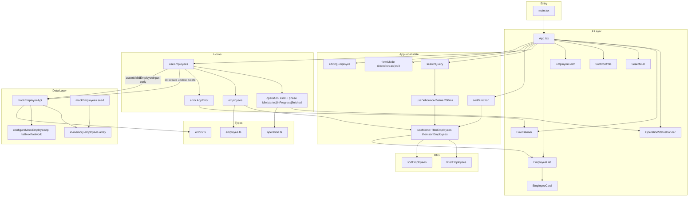

# Employee Directory — Architecture

Local-only Vite + React + TypeScript app. No real backend; CRUD goes through an in-memory mock API with simulated latency and typed errors.

## System diagram

## Layer summary

| Layer | Responsibility |
|---|---|
| **UI** | Presentational components; App owns layout and wires hooks → props |
| **App-local state** | Search input, debounce, sort direction, form open/edit mode; memoized visible list |
| **Hooks** | `useEmployees` owns employees, operation lifecycle, errors, and CRUD calls |
| **Utils** | Pure `filterEmployees` / `sortEmployees` (no nested loops) |
| **Types** | `Employee`, `AppError`, `OperationState` / kind / phase |
| **Data** | Seed data + `mockEmployeeApi` in-memory store, latency, validation, injectable network failure |

## Data flow notes

1. **Load / CRUD** — `useEmployees` sets operation `started` → `inProgress`, calls `mockEmployeeApi`, then `finished` (~1.5s) or clears to `idle` with an `AppError`.
2. **Status strip** — reads `operation` only; hidden when `idle`.
3. **Errors** — typed codes (`VALIDATION`, `NOT_FOUND`, `DUPLICATE_EMAIL`, `NETWORK`, `UNKNOWN`); validation runs before the lifecycle starts for create/update.
4. **Search** — input updates immediately; filtering uses the 200ms-debounced value.
5. **List** — `EmployeeList` receives already filtered + sorted employees and renders `EmployeeCard`s.
